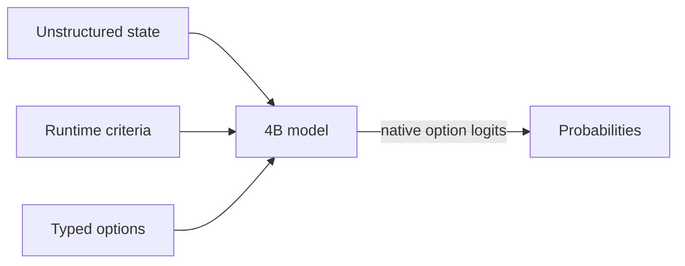

# Semlf-RyzenAI

A fork of [SemIf (formerly OpenJev)](https://github.com/TheoLeeCJ/SemIf) for
Windows and AMD Ryzen AI 1.8.0. It adds direct option scoring and a local web
demo comparing direct logits with streamed JSON generation, using AMD's
official Qwen3-4B NPU model configuration, including its CPU components.

Start with the [Ryzen AI setup guide](docs/RYZENAI.md). After setup, run
`./run_semif_npu_demo.ps1`, then open either demo:

- **日本語版 / Japanese:** [http://127.0.0.1:8008/](http://127.0.0.1:8008/)
- **English:** [http://127.0.0.1:8008/en/](http://127.0.0.1:8008/en/)

Both pages require the local server. They share the same loaded model and
include localized examples and controls. A plain-text guide is also available
in [README.txt](README.txt). Use `./run_semif_npu.ps1` for JSONL scoring.
The demo opens with a 16-option receipt-routing example (up to 32 options are supported)
for observing the cost of generating the complete probability object.

## Qwen3.5-4B NPU 16K — verified on Ryzen AI 1.8.0 (2026-09-20)

**日本語:** Qwen3.5-4BのNPU・16K対応モデルを変換し、実機検証まで完了しました。
16,384トークンの先頭・末尾に置いた情報を問うテストは両方正解し、
16,380入力＋4トークン生成も終了トークンで正常終了しました。
一部CPU処理を含む実験版です。従来の1トークン単位の実装では、
16K入力処理に約15分かかりました。

**English:** The experimental Qwen3.5-4B conversion passes the owned 16K
prefill and near-boundary generation checks on Ryzen AI 1.8.0 hardware.

| Hardware check | Result | Recorded evidence |
|---|---|---|
| Short English/Japanese inputs and the previously failing 64-token prefix | Three complete questions correct; short generation ends at EOS; all observed logits and all 64 prefix states finite | [Short-run report](results/raw/qwen35-conversion-20260920/dd-stable-prefix-short.json) |
| Information at the head and tail of a 16K input | Both correct at exactly 16,384 input tokens; all observed full-vocabulary logits finite | [16K report](results/raw/qwen35-conversion-20260920/dd-stable-16k.json) |
| Generation near the context limit | 16,380 input tokens plus four sampled tokens including EOS; three DD decode steps; correct answer and clean exit 0; all observed logits and read states finite | [Generation report](results/raw/qwen35-conversion-20260920/near16k-decode/manifest.json) |

The complete short, 16K, and near-boundary validation runs recorded 16,260,
1,075,563, and 531,411 completed NPU commands respectively, each with zero
errors. In the near-boundary batch-1 greedy run, OGA omits terminal EOS from
its returned sequence. Four tokens are sampled, but the final API-returned
sequence has 16,383 entries. The input-plus-sampled count, including EOS,
is 16,384.

The conversion uses **Quark 0.11 UINT4 RTN/MinMax, asymmetric group size 128**,
OGA export, and 273 custom DD token partitions. The
`--prefill-linear-attention token_loop` option runs the 24 prefill
LinearAttention operators one token at a time on the NPU, while retaining
batched execution for the other prefill projections. CPU convolution, GQA,
and host operations remain; no GPU provider is configured. This is a custom
integration, not AMD's supported recipe or the reference model's AWQ recipe.

The historical token-loop implementation took approximately **15 minutes**
for these 16K inputs. The optimized implementation below takes
**92.844–94.956 seconds** on the same owned inputs.
These owned functional checks are not general quality or speed benchmarks.
See the [conversion and validation guide](docs/QWEN35_NPU.md) for exact
revisions, model identities, the original failures, and reproduction commands.

### Prefill speed improvement

**日本語:** NPUで処理する区間を入力に応じてまとめ、途中結果のコピーを減らし、
語彙への変換を最後の位置に限定しました。
同じ短文の読み込み後の直接判定時間は英語で約6.69秒から0.98秒、日本語で約6.85秒から0.97秒に短縮しました。
1K・2K入力を含む7件の直接判定はすべて正解しました。
16K入力も先頭・末尾とも正解し、約908～930秒から約93～95秒に短縮しました。

The experimental `adaptive` prefill groups tokens using a per-head log-gate
budget of 64, keeps native computation and recurrent state in BF16, and
collects attention outputs without repeatedly copying the entire prefix.
Other prefill projections use a global chunk size of 1,024. The additional
`--prune-prefill-lm-head` option projects only the last position into the
248,320-token vocabulary while retaining all state updates. Weights and the
DD decode branch are unchanged.

| Owned input | Previous token loop | Adaptive prefill | Adaptive + last-position LM head |
|---|---:|---:|---:|
| English, 94 tokens | 6.689 s | 3.121 s | **0.984 s** |
| Japanese, 96 tokens | 6.850 s | 3.422 s | **0.972 s** |
| English with reversed options, 94 tokens | 6.740 s | 3.114 s | **0.953 s** |
| Head sentinel, 1,024 tokens | Not measured | 8.246 s | **4.464 s** |
| Tail sentinel, 2,048 tokens | Not measured | 14.304 s | **9.392 s** |
| Head sentinel, 16,384 tokens | 907.923 s | 160.317 s | **94.956 s** |
| Tail sentinel, 16,384 tokens | 929.666 s | 132.207 s | **92.844 s** |

English timings for both adaptive variants are medians of three identical
inputs; the historical English timing and all other entries are individual
observations. The previous timings come from the
earlier run on the same PC and model weights. Timings exclude model loading
and include host work and logit readout. All observed full-vocabulary logits
and all 64 states read for the regression prefix were finite; the supervised
short/2K run completed 9,216 NPU commands with zero errors and exit code 0.
See the [row-level evidence](results/raw/qwen35-speed-20260920/pruned-short-2k.json),
the [intermediate adaptive run](results/raw/qwen35-speed-20260920/short-2k.json),
and [reproduction instructions](docs/QWEN35_NPU.md#adaptive-prefill).

The separate [16K run](results/raw/qwen35-speed-20260920/pruned-long-16k.json)
also passed near-boundary generation: 16,380 input tokens, four sampled
tokens including EOS, and three DD decode steps. All observed logits and
all 64 final states were finite; 64,903 NPU commands completed with zero
errors and exit code 0. The head and tail timings are single observations
in that order, not randomized repeats. The cold-start stage—including
model/tokenizer loading, initial artifact validation, and the post-load NPU
snapshot—took approximately 217–222 seconds across these diagnostic runs
and is excluded from the table.

Native batched attention has greater rounding error than per-token execution
in the captured operator check. These owned checks do not establish general
model quality or replace the SemIf Speed and Quality suites. The completed
comparison of the optimized artifact follows.

### Qwen3.5 versus Qwen3: Speed and Quality

**日本語:** 高速化後のQwen3.5-4BとAMD公式Qwen3-4Bを、同じ入力で比較しました。
21件の直接判定はQwen3.5が178.49秒、Qwen3が78.16秒で、Qwen3.5は約2.28倍の時間を要しました。
Qualityの主要8指標はQwen3.5が6指標で上回り、2指標は同値でした。
JSON生成はQwen3.5が3回とも20件しか回答せず、必要な21件を満たしませんでした。

**English:** These measurements compare the optimized custom Qwen3.5-4B
16K deployment with AMD's official Qwen3-4B 16K deployment on the same
Ryzen AI Max+ 395, using Ryzen AI 1.8.0. Both Speed runs were measured
sequentially on **2026-09-20 UTC** (September 20–21 in Japan), with identical
benchmark code and frozen inputs. Architecture, tokenizer, quantization,
and compiled graphs differ. CPU graph and host work are included; no GPU
offload is configured.

| Speed measure | Qwen3.5-4B, optimized 16K | Qwen3-4B, AMD 16K |
|---|---:|---:|
| Fresh direct, 21 decisions, median of 3 | **178.492 s** | **78.159 s** |
| Compact JSON, median of 3 | 40.153 s | 9.050 s |
| Complete required 21-value arrays | **0/3** | **3/3** |
| EOS-terminated / truncated runs | 3/3 / 0/3 | 3/3 / 0/3 |
| Fresh Shape777, total time | 6,486.178 s | 2,850.042 s |
| Shape777 decisions/second | 0.119793 | 0.272628 |
| Shape777 state p50 | 174.715 s | 77.037 s |

Qwen3.5's JSON outputs were syntactically valid arrays containing **20 of
the required 21 values** in every repeat. They reached configured EOS at
106 tokens, below the unchanged 128-token cap. Their timing is therefore
**not a successful 21-answer completion time**. Qwen3 returned all 21 values
in every repeat, using 64 tokens. See the
[per-repeat output audit](results/raw/qwen35-speed-20260920/benchmark-recovery-audit.json)
and [complete comparison](results/raw/qwen35-vs-qwen3-20260920/comparison.json).

Speed includes prompt construction, tokenization, forward execution, readout,
and the full-vocabulary finite-logit checks. Initialization and evidence writes
are excluded. The recorded initialization stages took **211.084 s** for
Qwen3.5 and **21.074 s** for Qwen3. All direct calls start fresh; this NPU
benchmark does not implement shared-state or prefix-reuse modes.

| Quality measure | Qwen3.5-4B, optimized 16K | Qwen3-4B, AMD 16K |
|---|---:|---:|
| Authored144 mean-family balanced accuracy | **77.60%** | 69.45% |
| Perturbations108 mean-family balanced accuracy | **75.22%** | 67.35% |
| WANLI256 mean-family balanced accuracy | **63.24%** | 58.47% |
| TypeSafe102 equal-case modal agreement, 20 cases | **83.04%** | 62.95% |
| Every judgment36 accuracy | **80.56%** | 72.22% |
| Firewall10 action accuracy | **70.00%** | 50.00% |
| Code6 queries Recall@1 | 100.00% | 100.00% |
| Company7 queries Recall@1 | 92.86% | 92.86% |

Both Quality reports cover **all 814 rows**, with no context rejections.
Qwen3.5 Quality is newly measured; Qwen3 Quality uses the saved **2026-09-19**
16K run. Its 36 model-artifact hashes match the fresh Qwen3 Speed run, but
the historical Quality run has no recorded runtime DLL identity or later
full-vocabulary guard. Those checks are not attributed retrospectively to it.
TypeSafe total variation also decreased from 0.320081 to 0.197624; the full
reports retain the remaining metrics and individual predictions.

Both fresh jobs exited with code 0. Qwen3.5 passed **2,005** full-vocabulary
checks and completed **3,526,505** NPU commands with zero errors; Qwen3 passed
**1,058** checks and completed **595,994** commands with zero errors. Code,
runtime, and model artifact hashes matched their recorded pre/post checks.
The [publication manifest](results/raw/qwen35-vs-qwen3-20260920/manifest.json)
binds **3,308 prediction rows** and the execution evidence. The
[method and CPU-only verification commands](docs/METHOD.md#qwen35-versus-qwen3-comparison)
describe the timing scope, historical baseline, and evidence limitations.

### Run the converted model

Follow the [runtime setup](docs/RYZENAI.md) and
[conversion instructions](docs/QWEN35_NPU.md#public-custom-dd-conversion-command)
first. Model weights are not included in this repository. The command below
uses the local artifact that passed the hardware checks; substitute your
conversion output directory when reproducing it elsewhere.

```powershell
.\run_semif_npu.ps1 `
  -Model 'models/Qwen3.5-4B-adaptive-prefill-pruned-lmhead-dd-token-16k-chunk1024-run1' `
  -Revision '851bf6e806efd8d0a36b00ddf55e13ccb7b8cd0a' `
  -MaxTokens 16384
```

This runs direct scoring on `examples/decisions.jsonl` and creates a new
output file. Use `-InputFile` for another JSONL input. The local web demo
continues to use AMD's official Qwen3-4B model by default.

The upstream project description and its original benchmark results follow.

<div align="center">

**Semantic ifs from open models, on a 3090 at home.**

*Independent project; not affiliated with Jev or TypeSafe.*

**Wow! No waitlist.** [Run it in your browser today.](webgpu-demo/index.html)

[](demo/index.html)

*Same frozen 4B model · same state · same 21 questions · measured separately, aligned at t=0 in the replay*

</div>

> **Independent research project.** SemIf was formerly called OpenJev. It is not affiliated with or endorsed by TypeSafe. Jev, TypeSafe, and other names and marks are the property of their respective owners. No infringement is intended.


Most agent decisions are small: *route this*, *retry that*, *does the evidence support X?* A chat model can answer them, but it spends time generating text that software immediately parses back into an `if` statement.

Jev is TypeSafe's closed service for runtime-defined semantic decisions. This project reproduces that **interface pattern** with open models; it does not reproduce Jev's undisclosed model or training.

This baseline reads typed option probabilities directly from a model. No answer sentence, JSON repair, or decoding loop.

### Latest upstream changes — 2026-09-18

- Added MiniCPM5 2B and Qwen3.5 4B to the browser demo.
- Added **Unsloppify site**, a switch to a conventional interface.

## Quick start

**Apple Silicon:** use the native [MLX backend](docs/MLX.md) for direct scoring,
serial prefix reuse, and parallel shared-state decisions on macOS arm64.
Install `pip install -e '.[test,mlx]'` and add `--backend mlx` to the scorer command.

**Windows Ryzen AI NPU:** see [the Ryzen AI 1.8 guide](docs/RYZENAI.md) for the
AMD official NPU configuration (CPU host/prefill LM-head, no GPU offload) and
the SemIf direct-only launcher (`run_semif_npu.ps1`).
Run `./run_semif_npu_demo.ps1` for the local browser comparison of direct
option logits and streamed JSON generation at `http://127.0.0.1:8008`.

Python 3.10+, CUDA, and a GPU that can hold a 4B BF16 model:

```bash
python -m venv .venv
. .venv/bin/activate
export HF_HOME=/path/to/large-drive/huggingface
pip install -e '.[test,torch]'
```

Run the owned examples:

```bash
CUDA_VISIBLE_DEVICES=0 semif-score \
  --mode direct \
  --model Qwen/Qwen3.5-4B \
  --revision 851bf6e806efd8d0a36b00ddf55e13ccb7b8cd0a \
  --input examples/decisions.jsonl \
  --output results.jsonl
```

Each result contains typed option scores, timing, the exact model revision, and a prompt hash.

If every row has the same exact state, switch to `--mode shared` to prefill it once and evaluate the criteria in parallel.

## How it works



- **Runtime-defined:** criteria and option descriptions arrive with the request.
- **Decision-native:** one forward pass reads declared option logits; no answer token is sampled.
- **Shared-state aware:** one long state can be prefetched once, then branched across many criteria.
- **Auditable:** the owned fixture, exact runners, row-level outputs, revisions, prompts, and known failures are committed.

## Speed

### Decisions versus a compact generated array

Same frozen Qwen3.5-4B, same owned state, same 21 binary criteria, one RTX 3090:

| Output path | Time | Output tokens | Result |
|---|---:|---:|---|
| Direct typed logits, median of 3 | **1.023 s** | **0** | 21 probability pairs |
| Autoregressive JSON array, median of 3 | 5.332 s | 111 | Valid ordered 21-value array |

The compact generative baseline emits only ordered `"yes"`/`"no"` values—no keys, confidence objects, or explanations. Its median first-token time was 0.489 s, but completing the array took **5.21×** as long as direct readout. All three arrays were valid and identical. Their choices agreed with direct argmax on 18/21 criteria, so this is a systems comparison rather than a claim that the two readouts are semantically equivalent. [Exact prompt, outputs, token timeline, and runs](results/raw/decision-vs-compact-array.json) are committed.

### Reusing a state across 21 decisions

On an owned 37-state × 21-criterion workload:

| Execution path | Decisions/s | 777 decisions |
|---|---:|---:|
| Fresh direct scoring | 2.33 | 333.1 s |
| Serial prefix reuse | 10.75 | 72.3 s |
| Parallel suffixes | **20.03** | **38.8 s** |
| Native reranker | 1.86 | 417.3 s |

The owned [37×21 fixture](benchmarks/data/shape777.jsonl), [direct/reuse runner](benchmarks/shape777.py), [reranker runner](benchmarks/shape777_reranker.py), [raw timings](results/raw/shape777-direct.json), and [row-level predictions](results/raw/shape777-direct.predictions.jsonl) are included. The fast reuse paths are experimental: BF16 execution changed 5–6 of 777 argmaxes relative to fresh scoring.

### Ryzen AI 1.8 NPU direct versus compact generation

The AMD NPU run uses the official quantized Qwen3-4B 4K artifact,
which is a different model from the Qwen3.5-4B CUDA results above. It allows
the official CPU host/prefill/LM-head components and configures no GPU offload.
For the same 21-decision state, three fresh direct runs had a median of
**44.683 s**; three compact JSON runs had a median of **13.791 s**, or
**0.309×** the direct wall time (**3.24× faster**). The compact output used a
64-token median, all three runs were valid and EOS-terminated, and its choices
agreed with fresh direct argmax on **14/21** criteria. Each direct decision
prefilled independently; this comparison did not use an NPU shared-state
cache. The full 777-decision fresh pass took **1,421.510 s**, or
**0.547 decisions/s**, with a 21-decision state median of **38.403 s**.
Serial prefix reuse, parallel suffixes, and a native NPU reranker were not
implemented or measured.

The host was a Ryzen AI Max+ 395 with NPU driver 32.0.20102.3930. Hardware
counters recorded completed NPU submissions and zero hardware errors for the
scorer. This was a normal desktop session, not an exclusive-machine run.
See the [Ryzen AI guide](docs/RYZENAI.md),
[compact report](results/raw/ryzenai-4k-20260919/compact.json), and
[777-decision report](results/raw/ryzenai-4k-20260919/shape777.json) for the
exact scope and metadata.

## Quality

### Browser model ladder

| System | Browser artifact | Download | Authored balanced accuracy | Perturbation balanced accuracy | TypeSafe subset agreement |
|---|---|---:|---:|---:|---:|
| Qwen3-0.6B | Q8_0 | 639 MB | 0.440 | 0.528 | 0.407 |
| MiniCPM5-2B | Q4_K_M | 1.56 GB | 0.686 | 0.693 | 0.637 |
| **Qwen3.5-4B** | Q4_K_M | 3.01 GB | **0.813** | **0.766** | 0.845 |
| Published Jev | Closed hosted service | — | — | — | **0.883** |

*Native BF16 scores. Browser builds use quantized GGUF. Jev is TypeSafe's published result on the same 102-row subset.*

### General decision baseline

| Frozen workload | Rows | Direct logits (4B) | Native reranker (4B) | Published Jev |
|---|---:|---:|---:|---:|
| Authored decisions, balanced accuracy | 144 | **0.813** | 0.625 | — |
| WANLI, balanced accuracy | 256 | **0.637** | 0.522 | — |
| TypeSafe selected subset, modal agreement | 102 across 20 cases | **0.845** | 0.560 | 0.883 |
| Every judgment grid, accuracy | 36 | **0.806** | 0.694 | — |
| Every action firewall, composed accuracy | 10 actions | 0.700 | 0.700 | — |
| Every code retrieval, Recall@1 | 6 queries | 1.000 | 1.000 | — |
| Every company knowledge, Recall@1 | 7 queries | 0.929 | 0.929 | — |

The reranker remained strong at retrieval ranking, but direct logits were the better general-decision baseline.

The Jev number is read from TypeSafe's published records; we did not run a live Jev endpoint. The comparison covers the 102 rows that could be aligned from public artifacts, not TypeSafe's reported 711-row aggregate.

### Ryzen AI 1.8 NPU quality

These direct-scoring results use two distinct AMD Qwen3-4B compiled artifacts:
the 4K Full Fusion model and the 16K Token Fusion model. The 16K run's largest
observed input was 12,621 tokens. Both are separate from the upstream
Qwen3.5-4B BF16 claims above; the figures are not a context-only comparison.
The first three scores are mean family balanced accuracy. TypeSafe uses
equal-case modal agreement; TV is equal-case total variation distance.

| Frozen workload | 4K Full Fusion | 16K Token Fusion |
|---|---:|---:|
| Authored decisions | 144/144; **0.7254** | 144/144; **0.6945** |
| Perturbations | 108/108; **0.7039** | 108/108; **0.6735** |
| WANLI | 256/256; **0.5846** | 256/256; **0.5847** |
| TypeSafe | 73/102; 29 context rejections; **0.5354** full-denominator agreement | 102/102; **0.6295** agreement, 20 cases, TV **0.3201** |
| Every judge grid | 25/36; **0.6944** | 26/36; **0.7222** |
| Every action firewall | 5/10; **0.5000** | 5/10; **0.5000** |
| Every code retrieval | Recall@1 **1.0** | Recall@1 **1.0** |
| Every company knowledge | Recall@1 **0.9286** | Recall@1 **0.9286** |

The 4K TypeSafe covered-only figure was 0.7139 over 73 rows and 15 cases;
it is not directly comparable with the full 16K 102-row result. Both raw
[4K reports](results/raw/ryzenai-4k-20260919/quality.json) and [16K
reports](results/raw/ryzenai-16k-20260919/quality.json), together with their
[4K manifest](results/raw/ryzenai-4k-20260919/manifest.json) and [16K
manifest](results/raw/ryzenai-16k-20260919/manifest.json), preserve runtime
version metadata, model revisions, and model/input/code hashes.

## Input

```json
{
  "id": "route-1",
  "state": "Customer cannot access an account after a password reset.",
  "question": "Which queue should handle this request?",
  "options": [
    {"id": "access", "description": "Account access support."},
    {"id": "billing", "description": "Billing support."}
  ]
}
```

Returned probabilities are conditional on the supplied options. Calibrate and validate them on the workload where they will make decisions.
`state` may also be a nonempty JSON object or array. Direct modes preserve it as structured JSON; reranker mode renders it as document text.

## Documentation

- [Results](docs/RESULTS.md) — quality, speed, perturbations, and claim boundaries
- [Method](docs/METHOD.md) — frozen prompts, metrics, and timing scope
- [Reproduce](docs/REPRODUCE.md) — exact environment, pinned commands, perturbations, and verification
- [Interactive replay](demo/index.html)
- [Browser-only WebGPU demo](webgpu-demo/index.html) — no waitlist; use it today
- [Machine-readable summary](results/phase1-summary.json)
- [Benchmark bundle](benchmarks/README.md) — fixtures, runners, selection IDs, and reproduction commands
- [Raw results and checksums](results/raw/)
- [Third-party sources](THIRD_PARTY.md)

## Star history

[](https://www.star-history.com/#TheoLeeCJ/SemIf&Date)

## Evaluation sources

- [TypeSafe public evaluations](https://evals.typesafe.ai/) — public comparison cases used for selected-subset agreement
- [Every parallel judgment lab](https://typesafe-parallel-judgment-lab.every-4573.chatgpt.site/) and its [downloadable experiment data](https://typesafe-parallel-judgment-lab.every-4573.chatgpt.site/downloads/experiments.json)
- [WANLI](https://huggingface.co/datasets/alisawuffles/WANLI) — external natural-language inference check
- [Qwen3-0.6B](https://huggingface.co/Qwen/Qwen3-0.6B), [MiniCPM5-2B](https://huggingface.co/openbmb/MiniCPM5-2B), [Qwen3.5-4B](https://huggingface.co/Qwen/Qwen3.5-4B), and [Qwen3-Reranker-4B](https://huggingface.co/Qwen/Qwen3-Reranker-4B) — frozen baseline models

Model weights and third-party source records are not included. Upstream models retain their licenses. Project code is released under the [MIT License](LICENSE).
