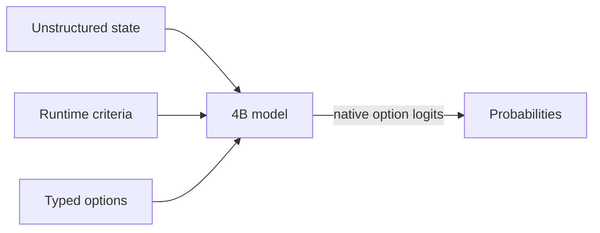

# Semlf-RyzenAI

A fork of [SemIf (formerly OpenJev)](https://github.com/TheoLeeCJ/SemIf) for
Windows and AMD Ryzen AI 1.8.0. It adds direct option scoring and a local web
demo comparing direct logits with streamed JSON generation, using AMD's
official Qwen3-4B NPU model configuration, including its CPU components.

Start with the [Ryzen AI setup guide](docs/RYZENAI.md). After setup, run
`./run_semif_npu_demo.ps1`, then open either demo:

- **日本語版 / Japanese:** [http://127.0.0.1:8008/](http://127.0.0.1:8008/)
- **English:** [http://127.0.0.1:8008/en/](http://127.0.0.1:8008/en/)

Both pages require the local server. They share the same loaded model and
include localized examples and controls. A plain-text guide is also available
in [README.txt](README.txt). Use `./run_semif_npu.ps1` for JSONL scoring.
The demo opens with a 16-option receipt-routing example (up to 32 options are supported)
for observing the cost of generating the complete probability object.

An experimental [Qwen3.5-4B conversion](docs/QWEN35_NPU.md) records the Quark
and OGA workflow and its current limitations. A combined eager-prefill and
273-DD-token candidate now passes three owned English/Japanese short cases
and a native greedy continuation ending at EOS, with finite full-vocabulary
logits and 5,307 completed NPU commands without errors.
[Short-run evidence](results/raw/qwen35-conversion-20260920/dd-integrated-short.json)
also records exact agreement with the eager baseline's option logits.
CPU graph components remain. The installed SDK recipe does not support this
custom Qwen3.5 integration; **16K validation failed: the tail-information
case passed, but the head-information case produced non-finite logits**.
A [fresh-process head check](results/raw/qwen35-conversion-20260920/dd-fresh-head-failure.json)
also returned all-NaN logits, so a preceding generator is not required to
trigger this failure. A diagnostic using only its
[first 64 tokens](results/raw/qwen35-conversion-20260920/dd-head-prefix64-failure.json)
also returned all-NaN logits. Chunk-related numerical behavior remains a hypothesis,
not an established cause or fix. This is not a completed 16K replacement
for the default AMD Qwen3-4B model.
The [public CLI rebuild](results/raw/qwen35-conversion-20260920/dd-public-build-reproducibility.json)
completed CPU conversion and matched the diagnostic candidate's content
under the documented comparison; the rebuilt package has not run inference.

The upstream project description and its original benchmark results follow.

<div align="center">

**Semantic ifs from open models, on a 3090 at home.**

*Independent project; not affiliated with Jev or TypeSafe.*

**Wow! No waitlist.** [Run it in your browser today.](webgpu-demo/index.html)

[](demo/index.html)

*Same frozen 4B model · same state · same 21 questions · measured separately, aligned at t=0 in the replay*

</div>

> **Independent research project.** SemIf was formerly called OpenJev. It is not affiliated with or endorsed by TypeSafe. Jev, TypeSafe, and other names and marks are the property of their respective owners. No infringement is intended.


Most agent decisions are small: *route this*, *retry that*, *does the evidence support X?* A chat model can answer them, but it spends time generating text that software immediately parses back into an `if` statement.

Jev is TypeSafe's closed service for runtime-defined semantic decisions. This project reproduces that **interface pattern** with open models; it does not reproduce Jev's undisclosed model or training.

This baseline reads typed option probabilities directly from a model. No answer sentence, JSON repair, or decoding loop.

### Latest changes — 2026-09-18

- Added MiniCPM5 2B and Qwen3.5 4B to the browser demo.
- Added **Unsloppify site**, a switch to a conventional interface.

## Quick start

**Apple Silicon:** use the native [MLX backend](docs/MLX.md) for direct scoring,
serial prefix reuse, and parallel shared-state decisions on macOS arm64.
Install `pip install -e '.[test,mlx]'` and add `--backend mlx` to the scorer command.

**Windows Ryzen AI NPU:** see [the Ryzen AI 1.8 guide](docs/RYZENAI.md) for the
AMD official NPU configuration (CPU host/prefill LM-head, no GPU offload) and
the SemIf direct-only launcher (`run_semif_npu.ps1`).
Run `./run_semif_npu_demo.ps1` for the local browser comparison of direct
option logits and streamed JSON generation at `http://127.0.0.1:8008`.

Python 3.10+, CUDA, and a GPU that can hold a 4B BF16 model:

```bash
python -m venv .venv
. .venv/bin/activate
export HF_HOME=/path/to/large-drive/huggingface
pip install -e '.[test,torch]'
```

Run the owned examples:

```bash
CUDA_VISIBLE_DEVICES=0 semif-score \
  --mode direct \
  --model Qwen/Qwen3.5-4B \
  --revision 851bf6e806efd8d0a36b00ddf55e13ccb7b8cd0a \
  --input examples/decisions.jsonl \
  --output results.jsonl
```

Each result contains typed option scores, timing, the exact model revision, and a prompt hash.

If every row has the same exact state, switch to `--mode shared` to prefill it once and evaluate the criteria in parallel.

## How it works



- **Runtime-defined:** criteria and option descriptions arrive with the request.
- **Decision-native:** one forward pass reads declared option logits; no answer token is sampled.
- **Shared-state aware:** one long state can be prefetched once, then branched across many criteria.
- **Auditable:** the owned fixture, exact runners, row-level outputs, revisions, prompts, and known failures are committed.

## Speed

### Decisions versus a compact generated array

Same frozen Qwen3.5-4B, same owned state, same 21 binary criteria, one RTX 3090:

| Output path | Time | Output tokens | Result |
|---|---:|---:|---|
| Direct typed logits, median of 3 | **1.023 s** | **0** | 21 probability pairs |
| Autoregressive JSON array, median of 3 | 5.332 s | 111 | Valid ordered 21-value array |

The compact generative baseline emits only ordered `"yes"`/`"no"` values—no keys, confidence objects, or explanations. Its median first-token time was 0.489 s, but completing the array took **5.21×** as long as direct readout. All three arrays were valid and identical. Their choices agreed with direct argmax on 18/21 criteria, so this is a systems comparison rather than a claim that the two readouts are semantically equivalent. [Exact prompt, outputs, token timeline, and runs](results/raw/decision-vs-compact-array.json) are committed.

### Reusing a state across 21 decisions

On an owned 37-state × 21-criterion workload:

| Execution path | Decisions/s | 777 decisions |
|---|---:|---:|
| Fresh direct scoring | 2.33 | 333.1 s |
| Serial prefix reuse | 10.75 | 72.3 s |
| Parallel suffixes | **20.03** | **38.8 s** |
| Native reranker | 1.86 | 417.3 s |

The owned [37×21 fixture](benchmarks/data/shape777.jsonl), [direct/reuse runner](benchmarks/shape777.py), [reranker runner](benchmarks/shape777_reranker.py), [raw timings](results/raw/shape777-direct.json), and [row-level predictions](results/raw/shape777-direct.predictions.jsonl) are included. The fast reuse paths are experimental: BF16 execution changed 5–6 of 777 argmaxes relative to fresh scoring.

### Ryzen AI 1.8 NPU direct versus compact generation

The AMD NPU run uses the official quantized Qwen3-4B 4K artifact,
which is a different model from the Qwen3.5-4B CUDA results above. It allows
the official CPU host/prefill/LM-head components and configures no GPU offload.
For the same 21-decision state, three fresh direct runs had a median of
**44.683 s**; three compact JSON runs had a median of **13.791 s**, or
**0.309×** the direct wall time (**3.24× faster**). The compact output used a
64-token median, all three runs were valid and EOS-terminated, and its choices
agreed with fresh direct argmax on **14/21** criteria. Each direct decision
prefilled independently; this comparison did not use an NPU shared-state
cache. The full 777-decision fresh pass took **1,421.510 s**, or
**0.547 decisions/s**, with a 21-decision state median of **38.403 s**.
Serial prefix reuse, parallel suffixes, and a native NPU reranker were not
implemented or measured.

The host was a Ryzen AI Max+ 395 with NPU driver 32.0.20102.3930. Hardware
counters recorded completed NPU submissions and zero hardware errors for the
scorer. This was a normal desktop session, not an exclusive-machine run.
See the [Ryzen AI guide](docs/RYZENAI.md),
[compact report](results/raw/ryzenai-4k-20260919/compact.json), and
[777-decision report](results/raw/ryzenai-4k-20260919/shape777.json) for the
exact scope and metadata.

## Quality

### Browser model ladder

| System | Browser artifact | Download | Authored balanced accuracy | Perturbation balanced accuracy | TypeSafe subset agreement |
|---|---|---:|---:|---:|---:|
| Qwen3-0.6B | Q8_0 | 639 MB | 0.440 | 0.528 | 0.407 |
| MiniCPM5-2B | Q4_K_M | 1.56 GB | 0.686 | 0.693 | 0.637 |
| **Qwen3.5-4B** | Q4_K_M | 3.01 GB | **0.813** | **0.766** | 0.845 |
| Published Jev | Closed hosted service | — | — | — | **0.883** |

*Native BF16 scores. Browser builds use quantized GGUF. Jev is TypeSafe's published result on the same 102-row subset.*

### General decision baseline

| Frozen workload | Rows | Direct logits (4B) | Native reranker (4B) | Published Jev |
|---|---:|---:|---:|---:|
| Authored decisions, balanced accuracy | 144 | **0.813** | 0.625 | — |
| WANLI, balanced accuracy | 256 | **0.637** | 0.522 | — |
| TypeSafe selected subset, modal agreement | 102 across 20 cases | **0.845** | 0.560 | 0.883 |
| Every judgment grid, accuracy | 36 | **0.806** | 0.694 | — |
| Every action firewall, composed accuracy | 10 actions | 0.700 | 0.700 | — |
| Every code retrieval, Recall@1 | 6 queries | 1.000 | 1.000 | — |
| Every company knowledge, Recall@1 | 7 queries | 0.929 | 0.929 | — |

The reranker remained strong at retrieval ranking, but direct logits were the better general-decision baseline.

The Jev number is read from TypeSafe's published records; we did not run a live Jev endpoint. The comparison covers the 102 rows that could be aligned from public artifacts, not TypeSafe's reported 711-row aggregate.

### Ryzen AI 1.8 NPU quality

These direct-scoring results use two distinct AMD Qwen3-4B compiled artifacts:
the 4K Full Fusion model and the 16K Token Fusion model. The 16K run's largest
observed input was 12,621 tokens. Both are separate from the upstream
Qwen3.5-4B BF16 claims above; the figures are not a context-only comparison.
The first three scores are mean family balanced accuracy. TypeSafe uses
equal-case modal agreement; TV is equal-case total variation distance.

| Frozen workload | 4K Full Fusion | 16K Token Fusion |
|---|---:|---:|
| Authored decisions | 144/144; **0.7254** | 144/144; **0.6945** |
| Perturbations | 108/108; **0.7039** | 108/108; **0.6735** |
| WANLI | 256/256; **0.5846** | 256/256; **0.5847** |
| TypeSafe | 73/102; 29 context rejections; **0.5354** full-denominator agreement | 102/102; **0.6295** agreement, 20 cases, TV **0.3201** |
| Every judge grid | 25/36; **0.6944** | 26/36; **0.7222** |
| Every action firewall | 5/10; **0.5000** | 5/10; **0.5000** |
| Every code retrieval | Recall@1 **1.0** | Recall@1 **1.0** |
| Every company knowledge | Recall@1 **0.9286** | Recall@1 **0.9286** |

The 4K TypeSafe covered-only figure was 0.7139 over 73 rows and 15 cases;
it is not directly comparable with the full 16K 102-row result. Both raw
[4K reports](results/raw/ryzenai-4k-20260919/quality.json) and [16K
reports](results/raw/ryzenai-16k-20260919/quality.json), together with their
[4K manifest](results/raw/ryzenai-4k-20260919/manifest.json) and [16K
manifest](results/raw/ryzenai-16k-20260919/manifest.json), preserve model,
runtime, revision, input, and source-artifact hashes.

## Input

```json
{
  "id": "route-1",
  "state": "Customer cannot access an account after a password reset.",
  "question": "Which queue should handle this request?",
  "options": [
    {"id": "access", "description": "Account access support."},
    {"id": "billing", "description": "Billing support."}
  ]
}
```

Returned probabilities are conditional on the supplied options. Calibrate and validate them on the workload where they will make decisions.
`state` may also be a nonempty JSON object or array. Direct modes preserve it as structured JSON; reranker mode renders it as document text.

## Documentation

- [Results](docs/RESULTS.md) — quality, speed, perturbations, and claim boundaries
- [Method](docs/METHOD.md) — frozen prompts, metrics, and timing scope
- [Reproduce](docs/REPRODUCE.md) — exact environment, pinned commands, perturbations, and verification
- [Interactive replay](demo/index.html)
- [Browser-only WebGPU demo](webgpu-demo/index.html) — no waitlist; use it today
- [Machine-readable summary](results/phase1-summary.json)
- [Benchmark bundle](benchmarks/README.md) — fixtures, runners, selection IDs, and reproduction commands
- [Raw results and checksums](results/raw/)
- [Third-party sources](THIRD_PARTY.md)

## Star history

[](https://www.star-history.com/#TheoLeeCJ/SemIf&Date)

## Evaluation sources

- [TypeSafe public evaluations](https://evals.typesafe.ai/) — public comparison cases used for selected-subset agreement
- [Every parallel judgment lab](https://typesafe-parallel-judgment-lab.every-4573.chatgpt.site/) and its [downloadable experiment data](https://typesafe-parallel-judgment-lab.every-4573.chatgpt.site/downloads/experiments.json)
- [WANLI](https://huggingface.co/datasets/alisawuffles/WANLI) — external natural-language inference check
- [Qwen3-0.6B](https://huggingface.co/Qwen/Qwen3-0.6B), [MiniCPM5-2B](https://huggingface.co/openbmb/MiniCPM5-2B), [Qwen3.5-4B](https://huggingface.co/Qwen/Qwen3.5-4B), and [Qwen3-Reranker-4B](https://huggingface.co/Qwen/Qwen3-Reranker-4B) — frozen baseline models

Model weights and third-party source records are not included. Upstream models retain their licenses. Project code is released under the [MIT License](LICENSE).
